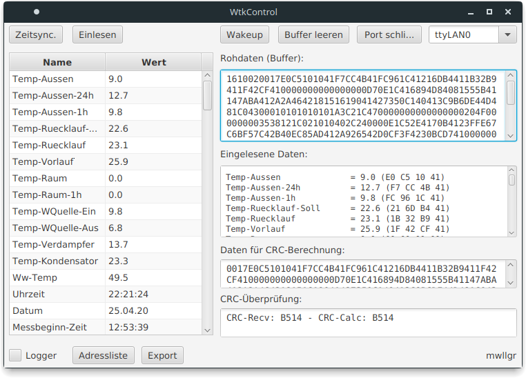

# Java(FX) control software for the Waterkotte Resümat CD4

## About this project  
This program allows you to control and monitor a Waterkotte Resümat heating controller via your PC.  
It uses the RS232 serial port of the Resümat controller.

### Disclaimer
**This is not an official software.**  
Do not set any values if the corresponding readings don't match the displayed data on the control unit itself or if any other readings are not correct! I'm not responsible for any damage!

## Running it
Download the release file (wtkcontrol-1.3.jar) from https://github.com/mwllgr/java-wtkcontrol/releases/tag/v1.3.0 and run it:
```bash
java -jar wtkcontrol-1.3.jar
```

Start by selecting an address file and opening the serial port - you might have enter the device name manually (e.g. `COM1` or `ttyUSB0`).  
Java version >= 11 is required to run the file.

## CLI mode
You can run the program without a GUI by using the parameter `--no-gui` with an appended `--port <device>`.  
When an `--address-list <file>` is not given, the file `address-list.csv` is used.

Only reading every address value is possible in "read mode" right now. You'd have to use a different CSV file if you only want to read specific values.

### Reading all values
Example:
```shell
java -jar wtkcontrol-1.3.jar --no-gui --port /dev/ttyUSB0
```

Output example:
```
Messbeginn-Datum=20.04.19
Hz-Messergebnis=4880.2
Mess-Reset=0
KomprBeginn-Zeit=01:01:01
KomprBetrStunden=43935.9
Unterbrechungen=00000000
```

### Writing/changing a value
Example:
```shell
java -jar wtkcontrol-1.3.jar --no-gui --port /dev/ttyUSB0 --write Ww-Temp-Soll --value 49.3
```

Output example:
```
ACK received!
```

### Available parameters
The following parameters *do not control any GUI elements* and are only working when the program is started in `--no-gui` mode!

| **Parameter**           | **Description**                                                                                                            | **Required** | **Default**        |
|-------------------------|----------------------------------------------------------------------------------------------------------------------------|--------------|--------------------|
| --no-gui                | Prevents starting the application in GUI mode                                                                              | Yes          | -                  |
| --port \<device\>       | Serial port device, e.g. `COM1` or `/dev/ttyUSB0`                                                                          | Yes          | -                  |
| --address-list \<file\> | Specifies the comma-separated address list                                                                                 | -            | `address-list.csv` |
| --logger                | *Only used in read mode:* Saves the received values into `wtk logger-dd-MM-yyyy_hh-mm-ss.csv` before the application exits | -            | -                  |
| --write \<name\>        | *Enables write mode:* Requires --value, writes <data> to field named <name> from CSV                                       | -            | -                  |
| --value \<data\>        | Requires --write, <data> has to be in a valid format/range                                                                 | With --write | -                  |
| --wakeup                | Sends a wake-up command to the heating controller                                                                          | -            | -                  |
| --time-sync             | Sends a command to sync the RTC of the controller with the local date and time                                             | -            | -                  |
| --help                  | Shows the CLI help                                                                                                         | -            | -                  |

### Exit codes

| **Code** | **Description**                                                       |
|----------|-----------------------------------------------------------------------|
| 1        | General error                                                         |
| 10       | Missing parameter or parameter value                                  |
| 11       | Serial port (communication) error                                     |
| 12       | File error, e.g. address file not found                               |
| 13       | Field for read/write operation not found in address file              |
| 14       | Field for write operation is read-only                                |
| 15       | Validation error: Value has invalid format or is not in a valid range |
| 16       | Address list malformed (e.g. invalid data type)                       |

## Documentation
A documentation for the GUI and the protocol is available in PDF only (school requirement).  
You can check it out here: [WtkControl_mwllgr.pdf](WtkControl_mwllgr.pdf)

As the main business area for this specific model is Germany and Austria, the program UI is written in German.

## Protocol description
An extended description of the protocol is available at [fhem-waterkotte-resuemat-cd4](https://github.com/mwllgr/fhem-waterkotte-resuemat-cd4#protocol-analysis).

## Screenshots

### Main window


